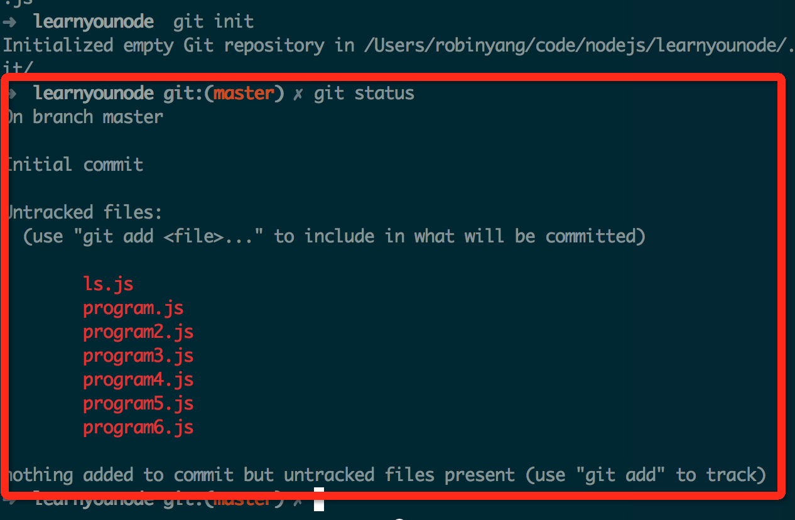

# git基础操作

##一. 初始化
我用我文件系统里的一个learnyoucode目录作为我们的工作目录作为例子讲解.  

首先，你需要切换到你的工作目录，然后输入如下命令:  

        git init

这样我们就在工作目录里初始化了一个git仓库，执行了这个命令之后， 我们就可以在工作目录下面使用git来进行一系列的操作了。

##二. 将已存在的文件纳入版本控制中
首先，执行下面的命令查看一下当前的文件状态:  
        
        git status
        
如果当前目录下已经存在我们要管理的文件,你会看到如下图所示的提示:

会列出没有加入到版本控制的文件列表，而且会给出如下提示:

        nothing added to commit but untracked files present (use "git add" to track)

track意思为行踪， 足迹, 可以理解为版本控制系统里没有这些文件的印记， 可以通过git add命令来添加.

下面我们执行`git add .` 命令来将当前目录的所有文件添加到版本控制, 当然如果你只想添加某个文件，比如说ls.js文件， 也可以用"`git add ls.js`"命令  

    ➜  learnyounode git:(master) ✗ git add .
    ➜  learnyounode git:(master) ✗ git status
    On branch master
    
    Initial commit
    
    Changes to be committed:
      (use "git rm --cached <file>..." to unstage)
    
    	new file:   ls.js
    	new file:   program.js
    	new file:   program2.js
    	new file:   program3.js
    	new file:   program4.js
    	new file:   program5.js
    	new file:   program6.js

我们执行`git add .`之后，并不会在终端有任何输出，我们接着执行一次`git status`, 会看到版本控制有了改变， 新增了几个文件， 这时我们可以使用git commit提交一下我们的更改

        ➜  learnyounode git:(master) ✗ git commit -m "add all untracked files to repository"
        [master (root-commit) 27ac421] add all untracked files to repository
         7 files changed, 57 insertions(+)
         create mode 100644 ls.js
         create mode 100644 program.js
         create mode 100644 program2.js
         create mode 100644 program3.js
         create mode 100644 program4.js
         create mode 100644 program5.js
         create mode 100644 program6.js
         
ok, 到现在我们已经把我们的更改保存到了版本控制中.

整个过程中使用的命令:

        git init                                #在工作目录初始化一个本地代码仓库
        git add .                               #将当前目录的所有文件放到版本控制中
        git commit -m "a change comment"        #提交更改
        
期间多次使用了`git status`来查看状态

##三. 提交文件改动到版本控制

下面我们更改一下文件内容， 就拿`ls.js`文件来举例, 为了不改变程序的行为，我们在该文件中加入一行注释,保存改动之后，在终端执行`git status`来查看一下状态,输出的片段如下:  

        modified:   ls.js
我们需要把这次修改提交到版本控制中, 最基本的是如下命令:

        git add ls.js
        git commit          #这个命令会打开默认的编辑器，编辑本次改动的描述, 编辑器一般默认为vi/vim, 这个编辑器没有接触过的人可能不知道如何使用， 如果暂时想要规避学习vim的成本，也可以在git配置中修改默认编辑器， 如何修改请自行搜索
    
    也可以用如下命令代替`git commit`

        git commit -m "change description"
`-m`选项的作用是， 不用打开默认编辑器来编辑改动描述，而是直接在命令后面跟一个描述的参数就可以。

或者只用一条合并`add`与`commit`的命令:

        git commit -am "change description"

`-a`选项的作用是: 在commit之前执行一次`git add .`， 这样虽然省事，但是建议的应用场景是如果改动描述能够足以描述你这次的所有改动，不然的话，请执行多次add/commit，将每个改动都描述清楚，方便看改动记录。

**注意**：这个命令只适用于文件的修改， 如果你在目录中添加了一个文件，然后想用`git commit -am ""`的方式来提交，这样是不行的, 新建文件之后，你要想把这个文件添加到版本控制里，必须要执行`git add filename`命令

##命令总结

        git init                #初始化一个git仓库
        git add filename        #将某个文件添加到代码仓库
        git commit              #将更改提交. 注意-a -m选项作用
        git status              # 查看当前仓库改动状态

