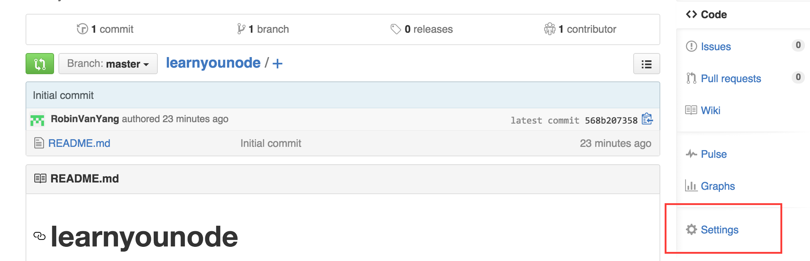
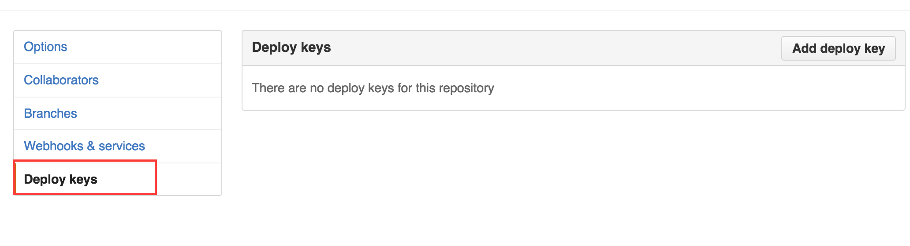
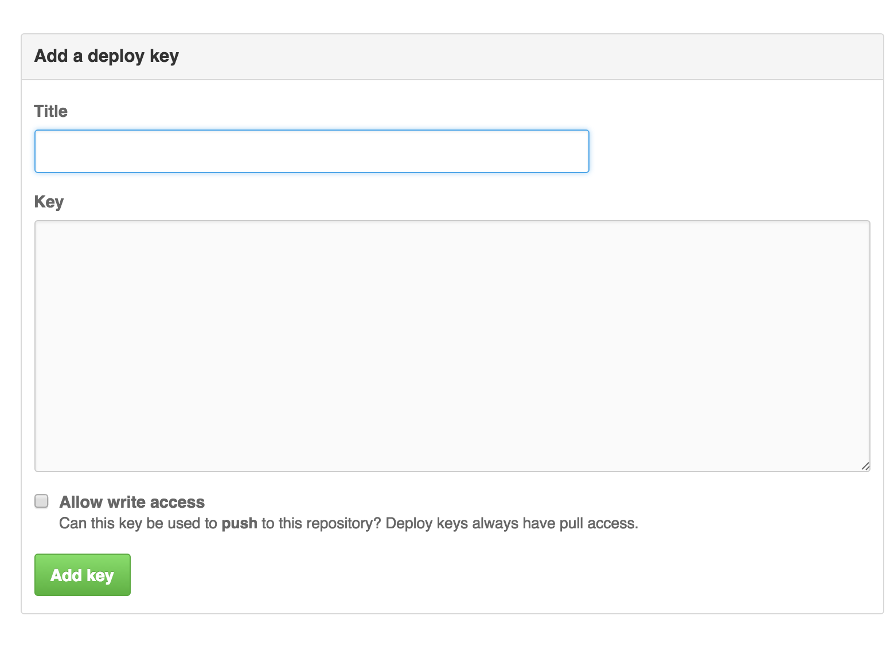

# 与远程版本库交互

&emsp;&emsp;在Git基础操作中， 我们讲解了如何创建一个版本库，及如何将文件及改动加入到版本控制中，这一节，我们介绍如何和远端的共用代码库交互.  

先简单讲一下我们为何需要共用库， 我觉得有两个重要原因:  
1. 可以保存我们的历史操作记录，方便文件历史操作的追溯
2. 方便多人协作
3. 

##将本地的代码存储到共用Git仓库

###一. 创建远端的共用库
我们使用GitHub作为我们的Git远程服务器, 假设我们已经有了GitHub账号，我们继续以learnyounode项目来作为范例进行操作。

首先，我们需要在GitHub上新建一个代码仓库来存放我们本地的代码,很简单，如图:  

注意上图中被圈起来的部分，我们选择了在创建仓库的时候新建一个README.md文件

创建好之后，我们还需要做一项工作才能将本地代码提交到远端的共用代码库
###二. 配置ssh-key
首先推荐一篇文章， 这篇文章就是专门讲如何配置ssh-key的:
[generate-ssh-keys](https://help.github.com/articles/generating-ssh-keys/)

#####第一步, 查看本地是否存在公私钥
我们需要查看一下`~/.ssh`文件夹，看一下之前有没有生成过公私钥
        
        ls ~/.ssh
输出中如果存在`id_rsa`及`id_rsa.pub`文件，那么证明本地存在ssh公私钥，请略过步骤二，直接看步骤三,如果不存在，请按照第二步先生成公私钥

#####第二步, 生成公私钥
在终端输入下面命令:  
        
        ssh-keygen -t rsa -b 4096 -C "your_email@example.com"
最后一个参数，请把值改为你的常用邮箱
按回车键，一路按默认的设置走，直到出现如下提示:

        Enter passphrase (empty for no passphrase):
这是让你输入一个口令，我嫌麻烦，都是直接回车键，让它为空的，但是 [generate-ssh-keys](https://help.github.com/articles/generating-ssh-keys/) 里建议设一个安全的口令， 这个看个人习惯设置。

全部设置好之后，终端`ls ~/.ssh`，可以看到目录中生成了公私钥.
#####第三步, 将公钥添加到我们GitHub刚才创建的仓库
整个操作参考下面几张图.

在共用仓库页面的右下角，有个`Settings`，如下图，点击

在转入的页面中点击左下角的`Deploy keys`

在右上角会看到一个`Add deploy key`按钮，点击之后会看到下面的一张表单:

Title这里随便填，我都是添的我电脑+系统的标识:MBP-OSX, key这里，我们需要填入刚刚生成的公钥文件的内容，可以在GUI中打开文件拷贝文件内容，也可以在终端用如下命令将文件内容拷贝到剪贴板:  

OSX系统:  
    
    pbcopy < ~/.ssh/id_rsa.pub

Ubuntu：
    
    $ sudo apt-get install xclip
    # Downloads and installs xclip. If you don't have `apt-get`, you might need to use another installer (like `yum`)
    
    $ xclip -sel clip < ~/.ssh/id_rsa.pub
    # Copies the contents of the id_rsa.pub file to your clipboard

好，将公钥串拷贝到Key这里，别忘记将`Allow write access`选项打钩(获取推送代码(push)到共用库权限)， 点击`Add key`按钮， GitHub会让你输入你的密码，好了，我们已经获取了这个共用库的读写权限.

远端库配置完毕，下面我们需要使用几个命令，将远端的库和我们本地的代码库相关联.

###三. 关联本地仓库与远端仓库
切换到我们之前的工作目录， 输入如下指令:

        git remote add origin git@github.com:RobinVanYang/learnyounode.git
        
ok, 下面使用下面指令查看远端仓库的配置情况:

        git remote -v

###四. 将本地文件push到远端仓库
指令:
        
        git push

如果你严格按照我在创建远端共用库所讲的来操作,你会发现如下错误:

        ➜  learnyounode git:(master) git push origin master
        To git@github.com:RobinVanYang/learnyounode.git
         ! [rejected]        master -> master (fetch first)
        error: failed to push some refs to 'git@github.com:RobinVanYang/learnyounode.git'
        hint: Updates were rejected because the remote contains work that you do
        hint: not have locally. This is usually caused by another repository pushing
        hint: to the same ref. You may want to first integrate the remote changes
        hint: (e.g., 'git pull ...') before pushing again.
        hint: See the 'Note about fast-forwards' in 'git push --help' for details.

我们在创建远端仓库的时候，在创建README那里打了勾， 远端共用库会生成一个README.md文件， 当我们push的时候，版本控制发现远端存在和本地不同的文件，这个时候会提示用户先拉取远端的改动到本地， 执行下面的指令拉拉取远端的改动:

        git pull origin master

执行指令后会弹出git的默认编辑器， 让用户添加这次merge(合并)的信息， 描述一下，然后按`:wq`保存并推出.

##从远端共用Git仓库中拉取代码