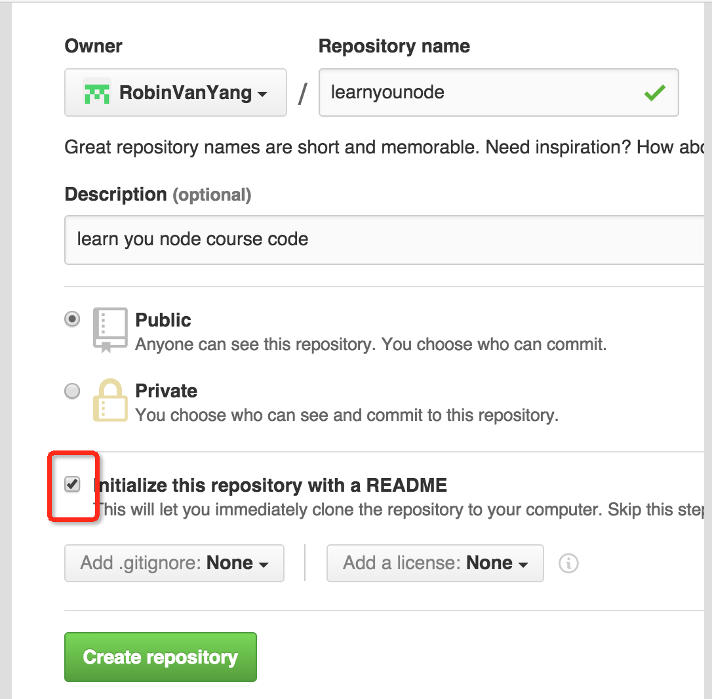

# 与远程版本库交互

在Git基础操作中， 我们讲解了如何创建一个版本库，及如何将文件及改动加入到版本控制中，这一节，我们介绍如何和远端的共用代码库交互.

##将本地的代码存储到共用Git仓库

###一. 创建远端的共用库
我们使用GitHub作为我们的Git远程服务器, 假设我们已经有了GitHub账号，我们继续以learnyounode项目来作为范例进行操作。

首先，我们需要在GitHub上新建一个代码仓库来存放我们本地的代码,很简单，如图:  

注意上图中被圈起来的部分，我们选择了在创建仓库的时候新建一个README.md文件

创建好之后，我们还需要做一项工作才能将本地代码提交到远端的共用代码库
###二. 配置ssh-key
首先推荐一篇文章， 这篇文章就是专门讲如何配置ssh-key的:
[generate-ssh-keys](https://help.github.com/articles/generating-ssh-keys/)

第一步， 我们需要查看一下`.ssh`

##从远端共用Git仓库中拉取代码